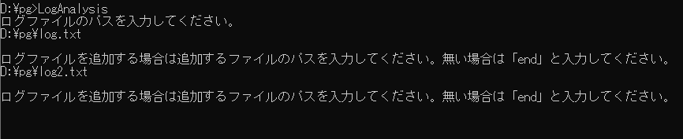
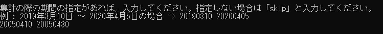
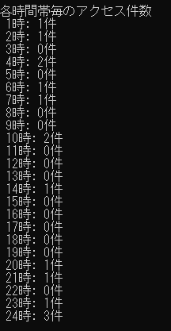
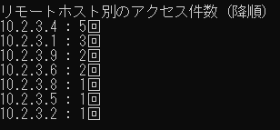

# LogAnalysis
プログラミング試験問題の回答プログラミングになります。

〇ビルド環境

言語: C# 

OS: Windows 10 Home バージョン 1903（OS ビルド 18362.778） 

総合開発環境: Microsoft Visual Studio Community 2019（Version 16.5.4） 

コンパイラー: Microsoft.NET v4.0.30319 

〇ビルド方式 

Visual Studioを使用し、コーディングした後にコマンドプロンプトにてcsc.exeを呼び出してビルドを行いました。

〇実行方法

LogAnalysis.exeをコマンドプロンプトから実行します。
その際に、出力される指示に従って、アクセスログファイルのパスを任意数と解析する期間(年月日)を入力してください。

--アクセスログファイルのパス入力例--

--解析する期間(年月日)の入力例--

入力された期間(年月日)の条件に合うアクセスログの中から、各時間帯毎のアクセス件数とアクセスの多いリモートホスト順にソートされた一覧
が出力されます。

--各時間帯毎のアクセス件数とアクセスの多いリモートホスト順にソートされた一覧の出力例--

   

〇作者

氏名: 上野拓海

e-mail: uetaku093010@gmail.com

〇参考文献

・[C#] リスト（List）の使い方まとめ, https://yaspage.com/prog/csharp/cs-list/, 2020/7/30 時点

・【C#入門】DictionaryのKey、Valueの使い方(要素の追加、取得も解説), https://www.sejuku.net/blog/41326, 2020/7/30 時点

・C#の配列の重複要素を削除する（LINQ Distinct）, https://araramistudio.jimdo.com/2020/01/21/c-の配列の重複要素を削除する-linq-distinct/, 2020/7/30 時点

・LINQ：データを並べ替える - orderby句［C#］, https://www.buildinsider.net/web/bookaspmvc5/050303, 2020/7/30 時点

・Apacheのアクセスログの見方, http://ossfan.net/setup/httpd-06.html, 2020/7/30 時点
